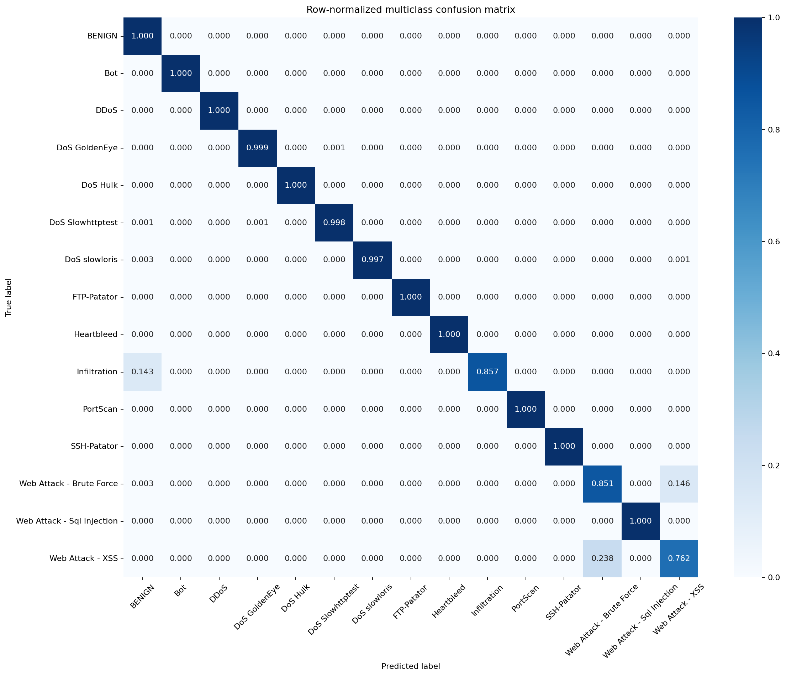
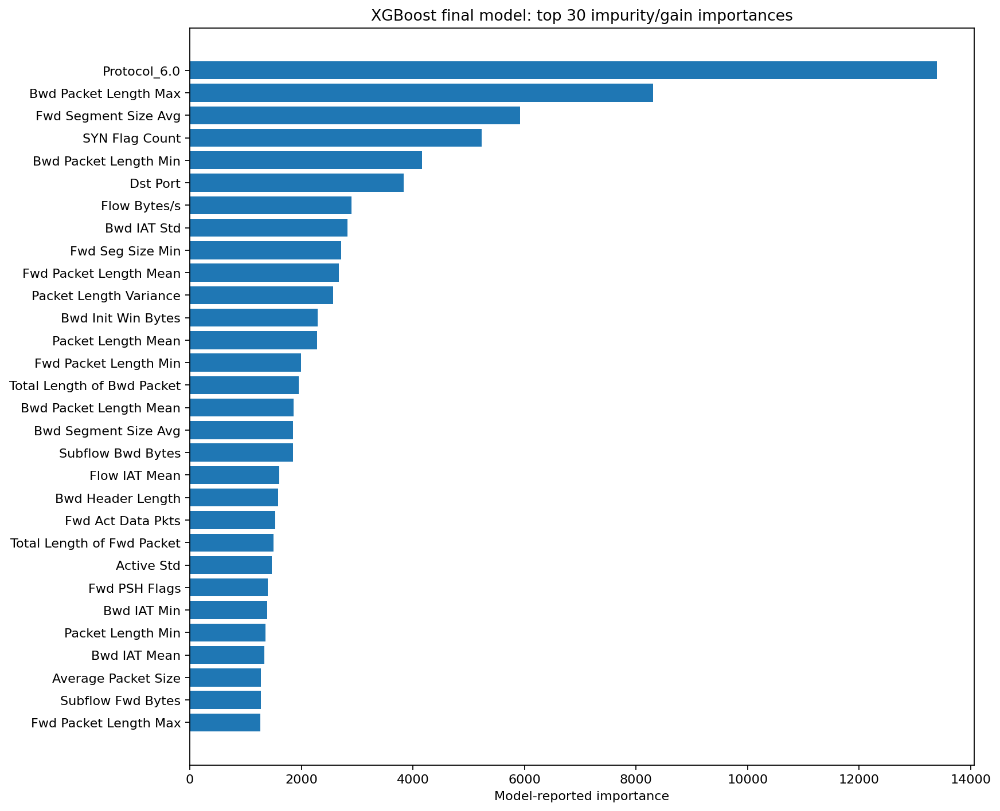

# Model-selection evidence and final results

This report records the results that changed a project decision. It deliberately excludes unsuccessful parameter trials and artifacts that did not affect selection. [Macro F1](METRICS.md#macro-f1) is the sole primary model-selection metric; accuracy, attack recall, latency, throughput, and class-level measurements are diagnostic or operational evidence.

The cleaned data was first divided into an 80% development partition and a protected 20% test partition. Screening and tuning used only development data. The protected test was evaluated once after preprocessing, features, parameters, and boosting iterations were frozen.

## 1. Experiment coverage

| Screening round | Completed | Planned |
|---|---:|---:|
| Baseline | 21 | 21 |
| Tree challengers | 12 | 12 |
| Neural challengers | 8 | 16 |

All planned MLP and ResNet configurations completed. The FT-Transformer and TabNet work was stopped before producing complete comparable results because it required substantial computation while monitored validation behavior showed no meaningful improvement. This justified stopping the screening budget; it does not establish that those architectures can never work on intrusion data.

## 2. Screening family leaders

The table retains the strongest validation configuration from every family that completed at least one comparable run. Latency measures the complete preprocessing-and-prediction pipeline on CPU.

| Model family | Features | Weighting | Macro F1 | Training (s) | CPU p99 (ms) | Throughput (flows/s) |
|---|---|---|---:|---:|---:|---:|
| XGBoost | all 71 | balanced | 0.9745 | 276.65 | 4.959 | 164,845 |
| LightGBM | reduced 64 | balanced | 0.9726 | 147.88 | 4.575 | 48,609 |
| Histogram Gradient Boosting | reduced 64 | balanced | 0.9670 | 83.83 | 18.949 | 100,393 |
| Random Forest | reduced 64 | balanced | 0.9484 | 164.77 | 33.906 | 188,724 |
| Decision Tree | reduced 64 | balanced | 0.9423 | 70.08 | 1.501 | 1,608,798 |
| Scikit-learn MLP | reduced 64 | unweighted | 0.7795 | 326.63 | 2.256 | 568,227 |
| ExtraTrees | all 71 | unweighted | 0.7059 | 322.62 | 50.612 | 85,654 |
| RTDL MLP | all 71 | unweighted | 0.7019 | 2,248.03 | 4.393 | 56,277 |
| RTDL ResNet | reduced 64 | unweighted | 0.6452 | 988.79 | 2.966 | 75,349 |
| SGD logistic classifier | all 71 | balanced | 0.4529 | 56.26 | 2.400 | 1,072,248 |
| Most-frequent Dummy | all 71 | unweighted | 0.0594 | 1.60 | 1.575 | 2,213,075 |

The Dummy result establishes that majority-class accuracy is not useful for this imbalanced task. SGD was far below the nonlinear models. The initial neural models required more training time without approaching the strongest tree ensembles. XGBoost and LightGBM therefore advanced to the fixed-budget tuning stage, while Histogram Gradient Boosting remained the strongest scikit-learn-only fallback.

## 3. Feature-set and weighting decision

XGBoost and LightGBM were screened with all 71 eligible source features and with the manually proposed reduced set of 64. Each schema was tested with unweighted and balanced training.

| Model | Features | Weighting | Macro F1 | Training (s) | CPU p99 (ms) | Throughput (flows/s) |
|---|---|---|---:|---:|---:|---:|
| XGBoost | all 71 | balanced | 0.974546 | 276.65 | 4.959 | 164,845 |
| XGBoost | reduced 64 | balanced | 0.968750 | 260.56 | 4.778 | 196,864 |
| XGBoost | all 71 | unweighted | 0.948885 | 273.33 | 4.179 | 211,442 |
| XGBoost | reduced 64 | unweighted | 0.948163 | 262.18 | 4.746 | 212,477 |
| LightGBM | reduced 64 | balanced | 0.972561 | 147.88 | 4.575 | 48,609 |
| LightGBM | all 71 | balanced | 0.972471 | 148.18 | 4.621 | 46,151 |
| LightGBM | reduced 64 | unweighted | 0.962958 | 143.75 | 5.271 | 46,099 |
| LightGBM | all 71 | unweighted | 0.959970 | 147.42 | 5.172 | 44,505 |

Balanced training materially improved macro F1 for both finalists. XGBoost clearly favored all 71 features. LightGBM's balanced reduced-set advantage was only `0.000089`, and its full schema made fewer validation mistakes in the detailed investigation. That difference was too small to justify locking in the manual removals. Both families therefore entered tuning with balanced training and all 71 features.

## 4. Top verified tuning candidates

Optuna proposed configurations using an inner validation holdout. The three strongest study candidates from each family were then refitted and compared on the fixed outer validation partition. These outer results, rather than the inner study scores, determined which configurations remained candidates.

### XGBoost

| Trial | Outer macro F1 | Selected iterations |
|---:|---:|---:|
| 14 | 0.972028 | 990 |
| 15 | 0.970435 | 650 |
| 16 | 0.968141 | 672 |

### LightGBM

| Trial | Outer macro F1 |
|---:|---:|
| 10 | 0.971369 |
| 7 | 0.970625 |
| 17 | 0.965753 |

XGBoost trial 14 had the highest verified outer-validation macro F1. The XGBoost and LightGBM leaders were close enough that one split alone was not considered sufficient evidence, so both advanced to the development-split stability check.

## 5. Stability evidence

The strongest verified setting from each boosting family was evaluated across identical stratified development splits using seeds `42`, `123`, and `2025`.

| Model | Mean macro F1 | Standard deviation | Minimum | Maximum | Range |
|---|---:|---:|---:|---:|---:|
| XGBoost | 0.972492 | 0.000432 | 0.972028 | 0.972884 | 0.000855 |
| LightGBM | 0.962862 | 0.007405 | 0.957856 | 0.971369 | 0.013513 |

XGBoost was stronger on average and substantially more stable. LightGBM remained competitive on the original split but varied considerably more when the development split changed. This evidence resolved the close single-split comparison in favor of tuned XGBoost.

### Original versus tuned XGBoost

The original fixed XGBoost screening configuration was also compared with the tuned configuration across the same seeds.

| Configuration | Mean macro F1 | Standard deviation | Minimum | Maximum | Range |
|---|---:|---:|---:|---:|---:|
| Original screening | 0.963573 | 0.010119 | 0.954610 | 0.974546 | 0.019935 |
| Tuned XGBoost | 0.972492 | 0.000432 | 0.972028 | 0.972884 | 0.000855 |

The original configuration was `0.002518` better on seed 42, but it was worse by `0.017954` and `0.011321` on seeds 123 and 2025. The tuned configuration therefore provided the stronger and much more stable development result. This comparison was diagnostic; automatic final selection remained restricted to verified tuned XGBoost candidates.

## 6. Frozen XGBoost recipe

The automatic selection step froze XGBoost trial 14 before the protected test was accessed:

- 71 source features and 73 transformed features;
- one-hot encoding for the three observed `Protocol` categories;
- balanced sample weights derived from fitting labels;
- 990 boosting iterations;
- random state 42;
- CUDA training and CPU inference.

| Hyperparameter | Frozen value |
|---|---:|
| `learning_rate` | 0.03173621813063171 |
| `max_depth` | 6 |
| `min_child_weight` | 3.578037743261042 |
| `subsample` | 0.8505785591708458 |
| `colsample_bytree` | 0.6649094628390888 |
| `gamma` | 0.14804890964996442 |
| `reg_alpha` | 0.050633727709206926 |
| `reg_lambda` | 0.5740122018683212 |

The complete immutable machine-readable contract is [final_model_spec.json](final_model_spec.json). Its internal MLflow source identifier is retained only because the finalization code uses it to verify that the JSON matches its selected source record.

## 7. Protected-test result

The frozen recipe was refitted without early stopping on all 2,259,801 development rows and evaluated once on 564,951 protected test rows.

| Metric | Result |
|---|---:|
| Macro F1 | **0.960157** |
| Accuracy, reference only | 0.999494 |
| Binary attack recall | 0.999910 |
| Training time | 381.77 s |
| CPU latency p50 | 9.679 ms |
| CPU latency p95 | 11.881 ms |
| CPU latency p99 | 13.308 ms |
| Batch throughput | 51,089.8 flows/s |
| Serialized pipeline size | 6.14 MiB |

Outer-validation macro F1 was `0.972028`; protected-test macro F1 was `0.960157`, a reduction of approximately `0.01187`. The change is noticeable but does not indicate catastrophic overfitting. The test score remains a strong result across the fixed 15-class label set.

### Per-class results

| Label | Precision | Recall | F1 | Support |
|---|---:|---:|---:|---:|
| BENIGN | 0.999978 | 0.999605 | 0.999792 | 453,679 |
| Bot | 0.842672 | 1.000000 | 0.914620 | 391 |
| DDoS | 0.999336 | 0.999961 | 0.999649 | 25,601 |
| DoS GoldenEye | 0.992757 | 0.999028 | 0.995883 | 2,058 |
| DoS Hulk | 0.998567 | 0.999717 | 0.999142 | 45,993 |
| DoS Slowhttptest | 0.987410 | 0.998182 | 0.992767 | 1,100 |
| DoS slowloris | 0.999135 | 0.996549 | 0.997840 | 1,159 |
| FTP-Patator | 1.000000 | 1.000000 | 1.000000 | 1,586 |
| Heartbleed | 1.000000 | 1.000000 | 1.000000 | 1 |
| Infiltration | 1.000000 | 0.857143 | 0.923077 | 7 |
| PortScan | 0.999811 | 0.999748 | 0.999780 | 31,761 |
| SSH-Patator | 1.000000 | 1.000000 | 1.000000 | 1,179 |
| Web Attack - Brute Force | 0.874150 | 0.850993 | 0.862416 | 302 |
| Web Attack - Sql Injection | 1.000000 | 1.000000 | 1.000000 | 4 |
| Web Attack - XSS | 0.678082 | 0.761538 | 0.717391 | 130 |

XSS is the weakest class. Web Brute Force and Bot are the next notable weaknesses, although Bot recall is complete and its lower precision reflects false alarms. Heartbleed, SQL Injection, and Infiltration have only 1, 4, and 7 test rows, so their apparently strong results are not statistically reliable class-level estimates.

Accuracy is recorded for reference but is dominated by the BENIGN majority and was not used for selection.

### Final diagnostics

The raw and normalized matrices are available as [published final artifacts](reports/published/README.md). The largest remaining confusion is between Web Attack - Brute Force and Web Attack - XSS.

Importance is a diagnostic of how often and how strongly the fitted trees used a transformed feature; it does not establish causality or justify automatic deletion. The model's use of protocol, ports, payload summaries, flags, and timing features may partly reflect CIC-IDS-2017-specific traffic patterns.

## Limitations and conclusion

This result demonstrates excellent performance and strong CPU inference characteristics on the fixed random stratified CIC-IDS-2017 benchmark. It does not establish equivalent behavior on another network, capture period, CICFlowMeter version, or attack distribution. Dataset-specific port, host, or attack-session patterns may make the benchmark easier than a real deployment.

The legacy binary inference service is not connected to this pipeline. Production deployment and external-dataset validation remain separate work.

The protected-test result is final. It must be reported as observed and must not be used to start another tuning round.
